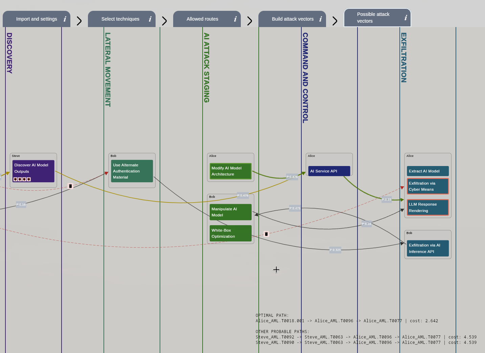
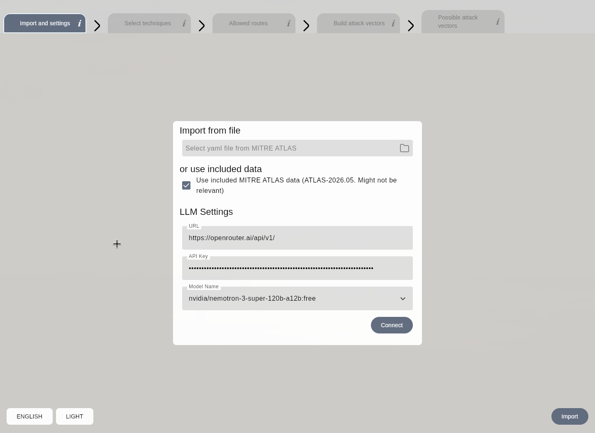
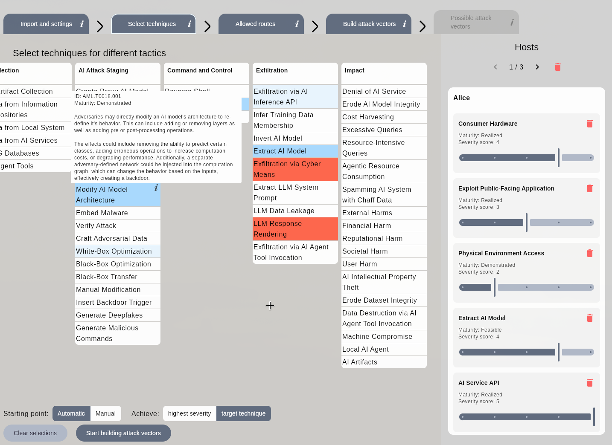
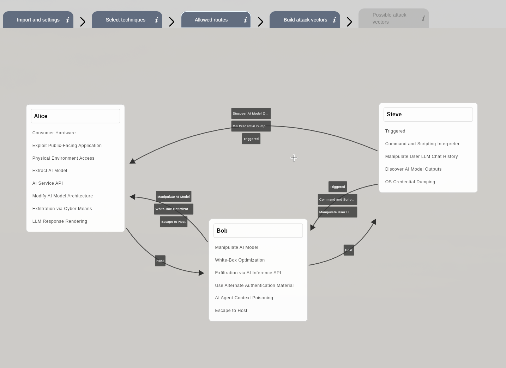

# AttackGraph

A desktop app for building theoretical attack graphs on AI systems from [MITRE ATLAS](https://atlas.mitre.org/) data.

You import the ATLAS knowledge base as a YAML file, describe your network (hosts, the techniques each host is exposed to, and which routes between hosts are allowed), and the app builds a graph of possible attacks and ranks the attack vectors — showing the cheapest path an adversary is likely to take from an entry point to a target technique.





## Install

Download a build for your platform from the [Releases page](https://github.com/Pobedie/mitre-graph/releases):

| Platform | Asset |
| --- | --- |
| Linux x64 | `AttackGraph-linux-x64.tar.gz` (unpack, run `bin/AttackGraph`) |
| macOS | `.dmg` |
| Windows | `.msi` |

### Build from source

Requires JDK 21. Gradle downloads its own toolchain if you don't have one.

```bash
git clone https://github.com/Pobedie/mitre-graph.git
cd mitre-graph
./gradlew :desktopApp:run
```

To produce an installer for the current OS:

```bash
./gradlew :desktopApp:packageDistributionForCurrentOS
```

## Usage

The app is a five-stage pipeline; the tabs across the top become available as you complete each stage. Every tab has an `i` button with a short reminder of what it expects.

### 1. Import and settings



Pick an ATLAS YAML dump — get one from the GitHub repo [mitre-atlas/atlas-data](https://github.com/mitre-atlas/atlas-data/blob/main/dist/) — or tick **Use included MITRE ATLAS data** to use the bundled snapshot. Import parses tactics, techniques, mitigations and case studies.

LLM settings are optional. Enter the base URL of any OpenAI-compatible API (e.g. `https://openrouter.ai/api/v1/`), an API key, and pick a model.


### 2. Select techniques



The ATLAS matrix is laid out by tactic, the same way the MITRE ATLAS website presents it. Create hosts (or leave just one) and pick attack techniques that are applicable to them. You can manually select from which techniques the attack vectors can start and what are the target techniques, or leave them in auto-selection mode.

For each technique on a host you set a severity score (1–5) — how damaging that technique would be on that host.


### 3. Allowed routes (firewall)



Select which attacks can be passed from one host to another (you can allow all attacks from host-to-host or only selected ones). If no rules are set, no restrictions are applied.

### 4. Build attack vectors

The attack vectors are built semi-automatically from the case studies captured by MITRE and from the LLM's decisions (if one is connected). The probabilities of edges are calculated automatically from the technique's maturity, severity score and the LLM's confidence.

The edges can also be set and edited manually.


### 5. Possible attack vectors


This stage calculates the most possible and 4 probable attack vectors using Dijkstra's algorithm.


## Built with

Kotlin Multiplatform · Compose Multiplatform (desktop/JVM) · SQLDelight · kaml · Ktor client
